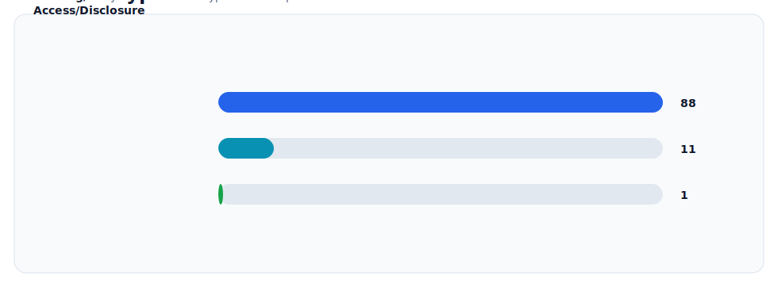
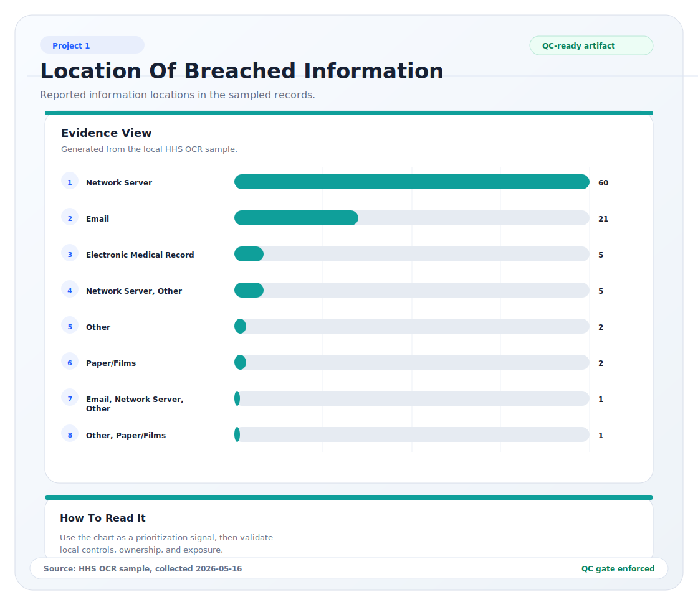
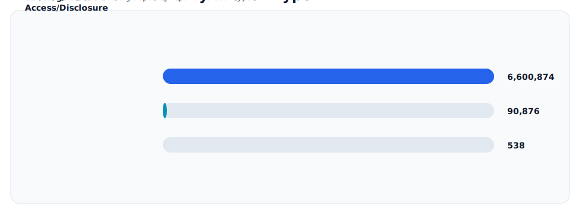

# Healthcare Breach Risk Assessment Using HHS OCR Data and NIST CSF 2.0

## Overview

This report analyzes public healthcare breach records from the U.S. Department of Health and Human Services Office for Civil Rights (HHS OCR) and maps the observed risk patterns to the NIST Cybersecurity Framework (CSF) 2.0.

The assessment focuses on one practical question:

> Based on recent public healthcare breach reports, which security risks should a small or modest-maturity healthcare organization prioritize first?

## How To Read This Project

This project is organized like a compact GRC analyst report. Start with the visual snapshot and key findings for the high-level story, then use the methodology, risk register, CSF mapping, roadmap, and executive brief to see how the evidence becomes risk decisions.

The goal is not to prove that every healthcare organization has the same control gaps. The goal is to show how public breach patterns can guide practical risk conversations around identity, exposed systems, third-party access, monitoring, response, and recovery.

## Visual Snapshot

These visuals were generated from the local HHS OCR sample using [`../../tools/generate_portfolio_visuals.py`](../../tools/generate_portfolio_visuals.py) and checked with [`../../tools/visual_quality_check.py`](../../tools/visual_quality_check.py).








## Evidence Base

The analysis uses a dated sample of the most recent 100 public HIPAA breach records displayed in the HHS OCR Breach Portal on May 16, 2026. The portal showed 710 HIPAA breach records at the time of collection. The sampled records had breach submission dates from February 9, 2026 through May 1, 2026.

The sample is stored in [`data/hhs-ocr-breach-sample-2026-05-16.csv`](data/hhs-ocr-breach-sample-2026-05-16.csv).

## Key Findings

| Finding | Evidence from sampled OCR records | Risk interpretation |
|---|---:|---|
| Hacking/IT incidents dominate recent reported breaches | 88 of 100 records | External compromise, credential abuse, exposed services, and vulnerable platforms should drive near-term control priorities. |
| Network servers are the most common reported information location | 60 of 100 records | Asset inventory, vulnerability management, hardening, logging, and backup coverage should be treated as core risk controls. |
| Email remains a major exposure point | 21 of 100 records | Phishing resistance, MFA, mailbox monitoring, and reporting workflows remain high-value controls. |
| Business associate involvement is material | 28 of 100 records marked business associate present | Vendor access, contract security expectations, breach notification pathways, and third-party oversight need defined ownership. |
| The sampled records represent large potential patient impact | 6,692,288 affected individuals across the sample | Even a small number of high-impact incidents can dominate risk exposure and leadership attention. |

## Analyst Competencies Represented

- Public-source data handling and transparent methodology
- Healthcare risk interpretation without using private patient data
- NIST CSF 2.0 mapping across Govern, Identify, Protect, Detect, Respond, and Recover
- Risk-register development with likelihood, impact, ownership, and response planning
- Executive communication that connects technical findings to business impact

## Deliverables

- [`data-methodology.md`](data-methodology.md): source list, collection method, fields used, and limitations
- [`breach-trend-analysis.md`](breach-trend-analysis.md): breach type, entity type, information location, and affected-individual patterns
- [`risk-register.md`](risk-register.md): evidence-informed healthcare risk register
- [`csf-mapping.md`](csf-mapping.md): mapping of findings to NIST CSF 2.0 functions and category themes
- [`prioritized-roadmap.md`](prioritized-roadmap.md): 30/60/90-day remediation roadmap
- [`executive-brief.md`](executive-brief.md): leadership-facing summary
- [`scripts/analyze_hhs_breaches.py`](scripts/analyze_hhs_breaches.py): repeatable Python analysis workflow
- [`outputs/hhs-breach-summary-2026-05-16.md`](outputs/hhs-breach-summary-2026-05-16.md): generated data summary
- [`visuals/`](visuals/): QC-checked SVG visual artifacts

## How To Run

From this project folder:

```powershell
python scripts/analyze_hhs_breaches.py data/hhs-ocr-breach-sample-2026-05-16.csv --as-of 2026-05-16 --output-dir outputs
python ..\..\tools\generate_portfolio_visuals.py --repo-root ..\..
python ..\..\tools\visual_quality_check.py visuals --report ..\..\project-management\visual-quality-report.md
```

The scripts use only Python's standard library.

## Source References

- HHS OCR Breach Portal: https://ocrportal.hhs.gov/ocr/breach/
- HHS HC3: https://www.hhs.gov/about/agencies/asa/ocio/hc3/index.html
- HHS Ransomware and HIPAA Fact Sheet: https://www.hhs.gov/hipaa/for-professionals/security/guidance/cybersecurity/ransomware-fact-sheet/index.html
- NIST Cybersecurity Framework 2.0: https://www.nist.gov/publications/nist-cybersecurity-framework-csf-20
- NIST SP 1300, CSF 2.0 Small Business Quick-Start Guide: https://csrc.nist.gov/pubs/sp/1300/final

## Boundary Statement

This report uses public breach records and public security guidance. It does not determine HIPAA compliance, provide legal advice, or assess any specific organization's internal controls.
