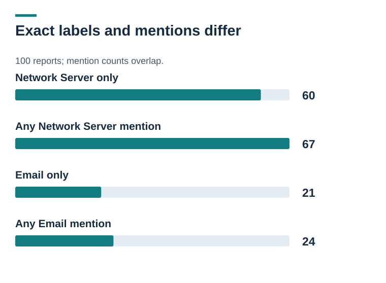

# Healthcare breach reports into risk questions

[Portfolio home](../../README.md) · [Technical walkthrough](breach-trend-analysis.md) · [Executive brief](executive-brief.md)

**Public-data analysis | Python, CSV, NIST Cybersecurity Framework 2.0**

Healthcare breach reports can help an analyst ask better questions about identity, data handling, and recovery. They cannot reveal the controls inside a particular organization.

I analyzed a dated sample of 100 public HHS Office for Civil Rights breach reports, then used the findings to develop a hypothetical healthcare risk register. My contribution here is the analysis and its interpretation, not an assessment of the reporting organizations.

## What the sample shows

The records report a combined **6,692,288 affected individuals**. This is a sum of reported counts, not a deduplicated count of people. One report contributes **46.6%** of that sum. The median report is **5,140.5**.

*Exact categories and mentions answer different questions. A report can mention more than one location, so the mention counts overlap. [Open full-size](visuals/information-location-records.svg).*

## A decision I can explain

Network Server appears in 67 records, including mixed-location records. That supports asking about server inventory, access, monitoring, and recovery. It does **not** prove that 67 organizations had weak server security.

I turned that distinction into [risk hypotheses](risk-register.md), mapped them to [NIST CSF functions](csf-mapping.md), and proposed an [evidence-first roadmap](prioritized-roadmap.md). A real assessment would need system owners, control evidence, and business impact before confirming ratings.

## Inspect the work

1. [Follow the calculation and interpretation](breach-trend-analysis.md).
2. [Review the sample and its limitations](data-methodology.md).
3. [Read the generated tables](outputs/hhs-breach-summary-2026-05-16.md) or [inspect the source CSV](data/hhs-ocr-breach-sample-2026-05-16.csv).
4. [Run the analysis](../../SETUP_GUIDE.md) and inspect [the script](scripts/analyze_hhs_breaches.py).

**Outcome:** a reproducible description of this sample and a proposed control discussion. No organization was audited, no HIPAA compliance conclusion was reached, and no control improvement was measured.

**What I learned:** a correct number can still mislead if the denominator, category definition, or source limitation is missing.

[Next: vulnerability intake](../02-cisa-kev-vulnerability-prioritization/README.md)

[Additional charts and diagrams](visuals/README.md)
