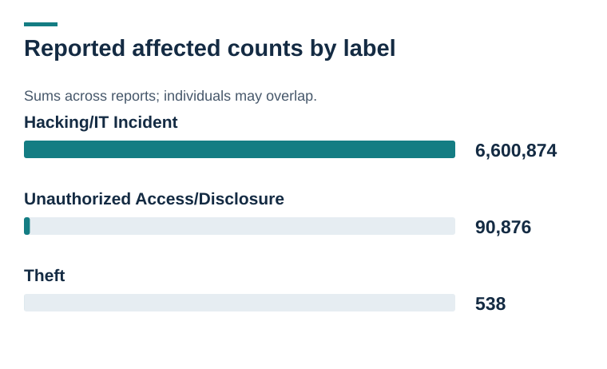
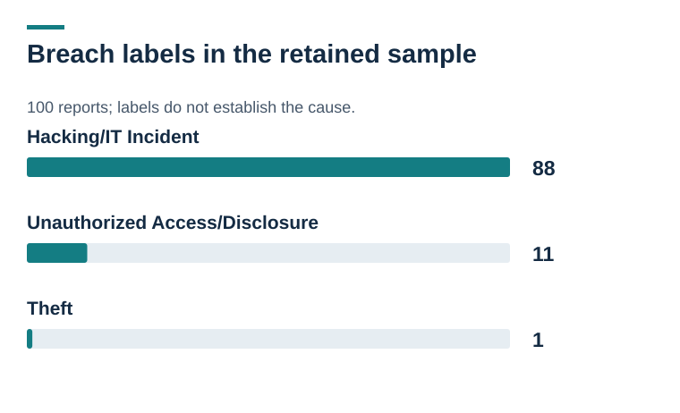
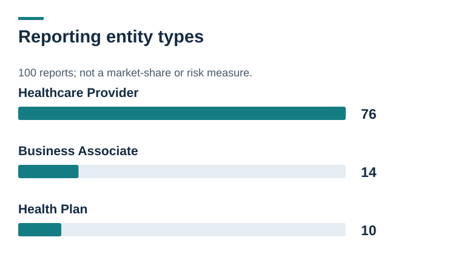

# Visual evidence and diagrams

[Project overview](../README.md)

## Reported affected counts by label

Sums across reports; individuals may overlap. Hacking/IT Incident: 6,600,874; Unauthorized Access/Disclosure: 90,876; Theft: 538 [Open full-size](affected-individuals-by-breach-type.svg).

## Breach labels in the retained sample

100 reports; labels do not establish the cause. Hacking/IT Incident: 88; Unauthorized Access/Disclosure: 11; Theft: 1 [Open full-size](breach-type-distribution.svg).

## Reporting entity types

100 reports; not a market-share or risk measure. Healthcare Provider: 76; Business Associate: 14; Health Plan: 10 [Open full-size](entity-type-distribution.svg).

## Read the denominator first

Retained HHS sample; not an industry estimate. 100 reported breaches: A convenience sample; original portal capture is missing. 6,692,288 reported affected individuals: A sum across reports, not a count of unique people. 46.6% from one report: The median is 5,140.5. Large reports strongly affect the total. [Open full-size](healthcare-breach-dashboard.svg).

## Exact labels and mentions differ

100 reports; mention counts overlap. Network Server only: 60; Any Network Server mention: 67; Email only: 21; Any Email mention: 24 [Open full-size](information-location-records.svg).
