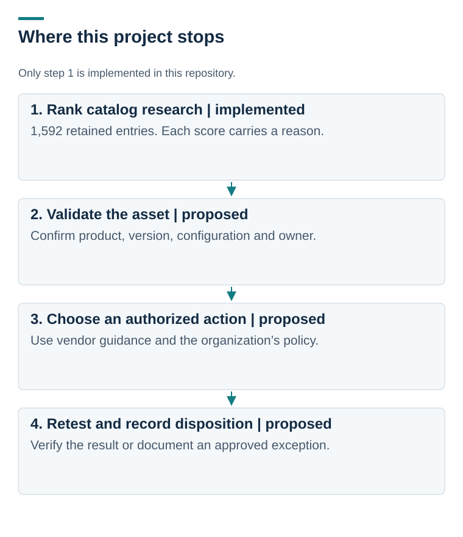

# Turning a vulnerability catalog into an intake queue

[Portfolio home](../../README.md) · [Worked example](kev-catalog-analysis.md) · [Scoring model](triage-model.md)

**Public-data analysis | Python, CSV, CISA Known Exploited Vulnerabilities**

A vulnerability team has to decide what to examine first. The CISA Known Exploited Vulnerabilities (KEV) catalog identifies vulnerabilities with evidence of exploitation, but it does not tell me which products an organization runs.

I built a reproducible intake model for the retained **1,592-entry** catalog. It orders research using catalog dates, reported ransomware use, and product keywords. Each row includes its score and reasons.

*This project implements catalog intake. Asset validation, remediation, and retesting are the next steps a real team would need. [Open full-size](visuals/kev-dashboard.svg).*

## The distinction that matters

An “edge/server” keyword can make a product worth investigating. It does not prove that the organization owns the product, runs an affected version, or exposes it to the internet.

I use labels such as **First review** rather than severity labels. An older overdue catalog entry keeps its due-date bonus; it does not become safer just because time passed. The weights are a custom learning model, not CISA guidance.

## Inspect one decision

The [walkthrough](kev-catalog-analysis.md) follows CVE-2024-1708 from the retained catalog into its 116-point intake score, then identifies the asset and vendor evidence needed before assigning remediation.

- [Top 50 research list](outputs/kev-prioritized-watchlist-2026-05-16.csv), with reasons for each score
- [Full ranking](outputs/kev-full-ranking-2026-05-16.csv), for checking all 1,592 entries
- [Generated catalog summary](outputs/kev-summary-2026-05-16.md)
- [Model and limitations](triage-model.md), [source notes](data-source-notes.md), and [Python code](scripts/analyze_kev.py)

**Outcome:** a repeatable research queue with explicit reasons. No assets were scanned, patches applied, or remediation deadlines verified.

**What I learned:** a clear intake score is useful only when the next analyst can see its assumptions and replace them with evidence from the actual environment.

[Next: identity threat research](../03-mitre-attack-cti-brief/README.md) · [Reproduce the analysis](../../SETUP_GUIDE.md)

[Additional charts and diagrams](visuals/README.md)
