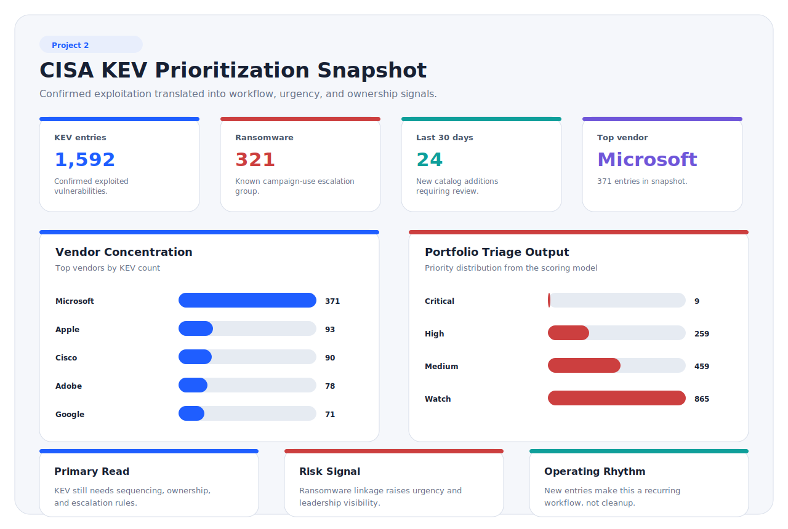
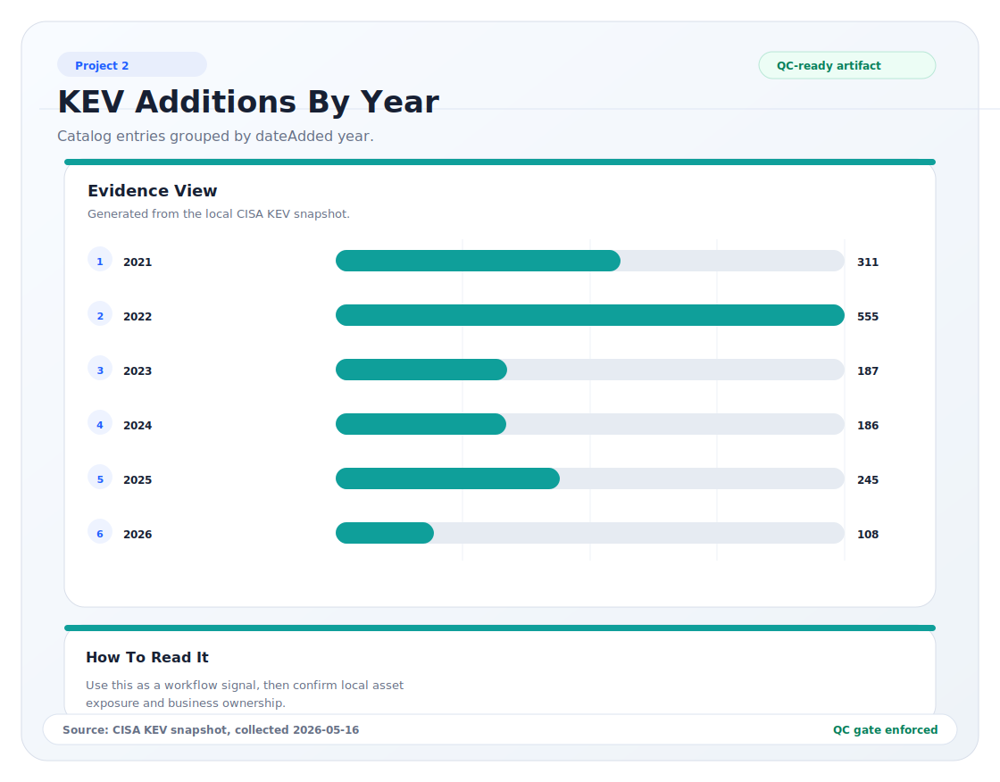
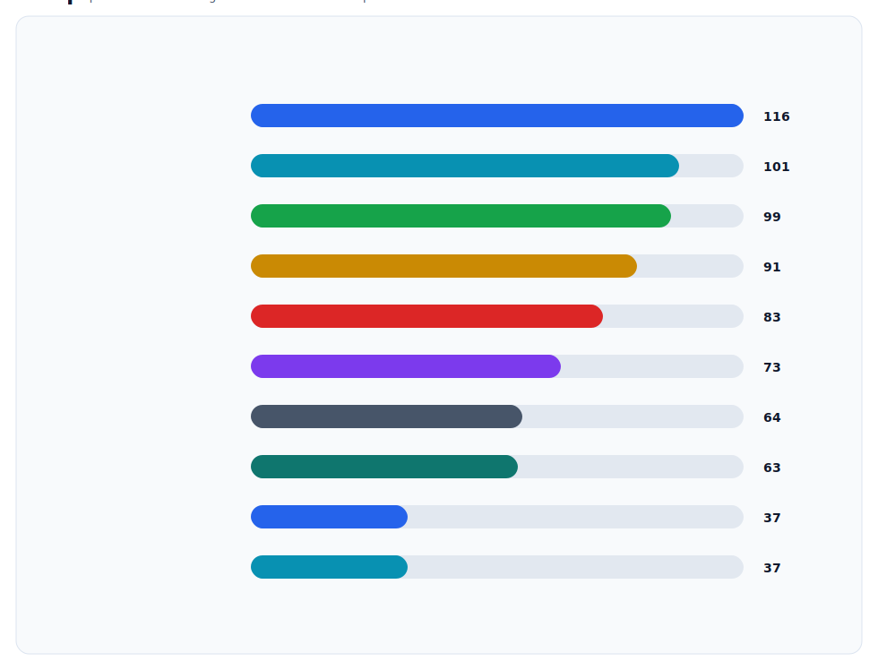

# KEV Catalog Analysis

## Catalog Snapshot

The May 16, 2026 analysis used the official CISA KEV feed released on May 15, 2026. The catalog contained 1,592 entries with `dateAdded` values ranging from November 3, 2021 through May 15, 2026.

| Metric | Value |
|---|---:|
| Total KEV entries | 1,592 |
| Added in last 30 days | 24 |
| Added in last 90 days | 74 |
| Added in last 180 days | 132 |
| Added in last 365 days | 248 |
| Known ransomware campaign use | 321 |
| Unknown ransomware campaign use | 1,271 |
| CISA due dates still in the future as of May 16, 2026 | 2 |

## Visual Summary

The charts below are generated by [`scripts/analyze_kev.py`](scripts/analyze_kev.py) from the local KEV snapshot. They help convert the catalog from a long list of CVEs into patterns that support remediation planning.

## Vendor Concentration

| Vendor | KEV count |
|---|---:|
| Microsoft | 371 |
| Apple | 93 |
| Cisco | 90 |
| Adobe | 78 |
| Google | 71 |
| Oracle | 42 |
| Apache | 39 |
| Ivanti | 34 |
| D-Link | 26 |
| Fortinet | 26 |

### Interpretation

Vendor concentration is useful for vulnerability management planning because it helps security teams compare KEV exposure with their own asset inventory. A company with heavy Microsoft, Cisco, Adobe, Google, Ivanti, or Fortinet usage should have a repeatable process for mapping KEV entries to installed software, asset owners, internet exposure, and remediation windows.

The vendor count should not be read as a statement that one vendor is inherently less secure than another. It is a prioritization signal for asset matching and operational readiness.

## Product Concentration

| Product | KEV count |
|---|---:|
| Microsoft Windows | 171 |
| Apple Multiple Products | 53 |
| Google Chromium V8 | 38 |
| Microsoft Internet Explorer | 34 |
| Adobe Flash Player | 33 |
| Microsoft Office | 29 |
| Linux Kernel | 25 |
| Microsoft Win32k | 25 |
| Microsoft Exchange Server | 17 |
| Synacor Zimbra Collaboration Suite (ZCS) | 15 |

### Interpretation

The product list shows why vulnerability prioritization cannot rely on CVSS alone. High-frequency product groups include operating systems, browsers, productivity tools, mail infrastructure, and legacy technologies. Those systems have different owners, patch windows, user impact, and compensating controls.

## CWE Patterns

| CWE | Count | Risk theme |
|---|---:|---|
| CWE-20 | 116 | Improper input validation |
| CWE-78 | 101 | OS command injection |
| CWE-787 | 99 | Out-of-bounds write |
| CWE-416 | 91 | Use after free |
| CWE-119 | 83 | Memory buffer bounds issue |
| CWE-22 | 73 | Path traversal |
| CWE-502 | 64 | Deserialization of untrusted data |
| CWE-94 | 63 | Code injection |
| CWE-287 | 37 | Improper authentication |
| CWE-843 | 37 | Type confusion |

### Interpretation

The CWE distribution supports a control-improvement view of vulnerability management. Remediation should not stop at individual patches. Repeated weakness classes should inform secure configuration baselines, software update governance, application security testing, vendor review, and compensating controls for systems that cannot be patched quickly.

## Latest KEV Additions

| Date added | CVE | Vendor | Product | Ransomware use | CISA due date |
|---|---|---|---|---|---|
| 2026-05-15 | CVE-2026-42897 | Microsoft | Microsoft | Unknown | 2026-05-29 |
| 2026-05-14 | CVE-2026-20182 | Cisco | Catalyst SD-WAN | Unknown | 2026-05-17 |
| 2026-05-08 | CVE-2026-42208 | BerriAI | LiteLLM | Unknown | 2026-05-11 |
| 2026-05-07 | CVE-2026-6973 | Ivanti | Endpoint Manager Mobile (EPMM) | Unknown | 2026-05-10 |
| 2026-05-06 | CVE-2026-0300 | Palo Alto Networks | PAN-OS | Unknown | 2026-05-09 |
| 2026-05-01 | CVE-2026-31431 | Linux | Kernel | Unknown | 2026-05-15 |
| 2026-04-30 | CVE-2026-41940 | WebPros | cPanel & WHM and WP2 (WordPress Squared) | Known | 2026-05-03 |
| 2026-04-28 | CVE-2024-1708 | ConnectWise | ScreenConnect | Known | 2026-05-12 |
| 2026-04-28 | CVE-2026-32202 | Microsoft | Windows | Unknown | 2026-05-12 |
| 2026-04-24 | CVE-2025-29635 | D-Link | DIR-823X | Unknown | 2026-05-08 |

## Operational Implications

1. KEV should be monitored weekly because new exploited vulnerabilities continue to enter the catalog.
2. Ransomware-linked KEV entries should trigger heightened escalation and leadership visibility.
3. Internet-facing, remote management, identity, and security-control products deserve faster validation.
4. Due dates should be used to create urgency, but asset ownership and exposure determine local remediation order.
5. Exception handling must be formal because not every exploited vulnerability can be patched immediately without business impact.
