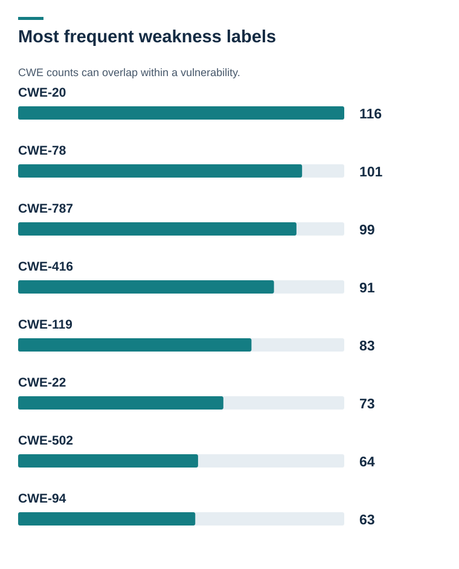
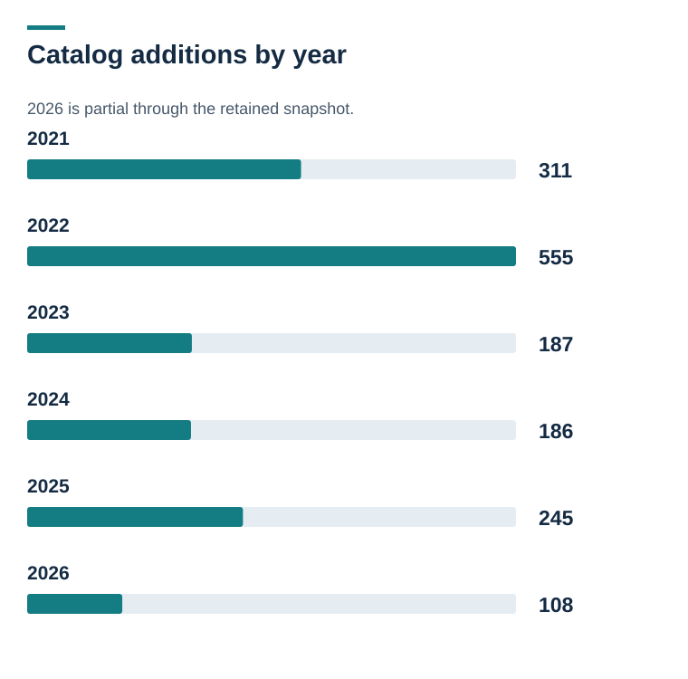
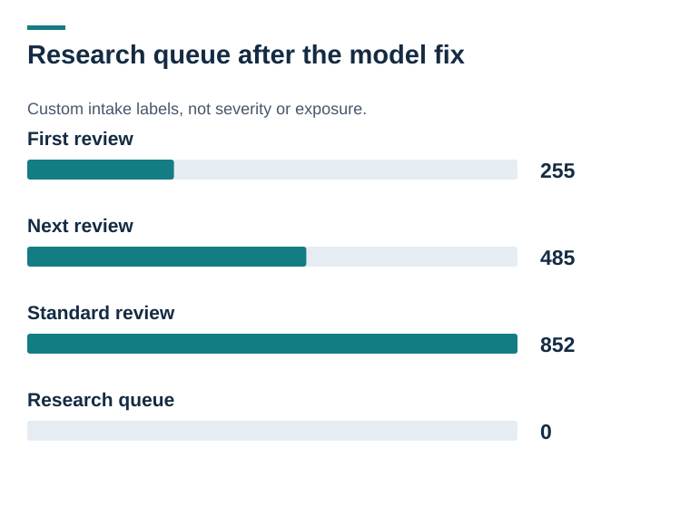
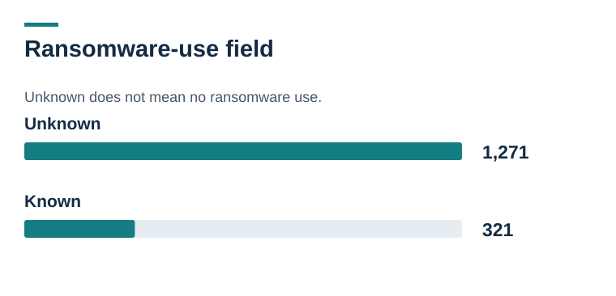
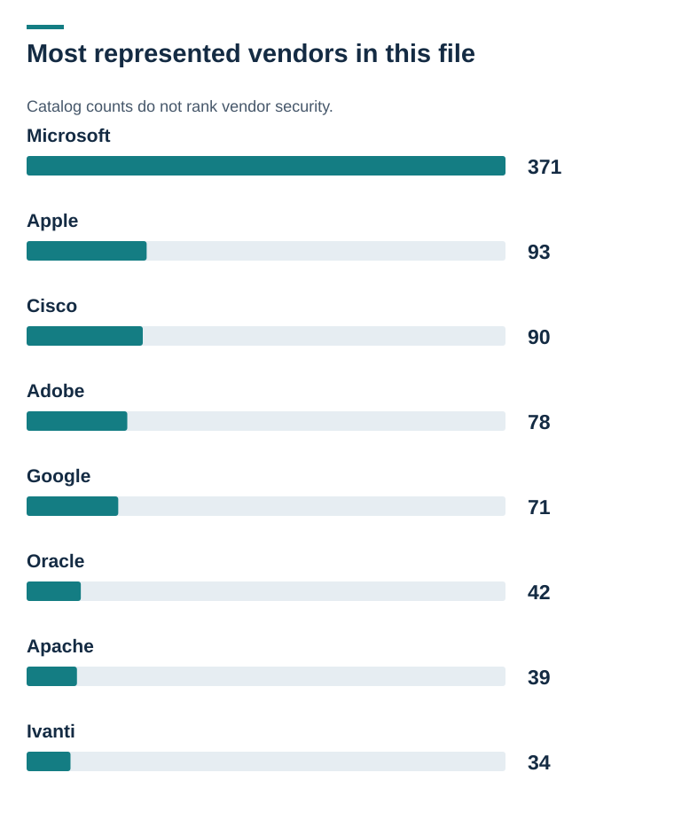

# Visual evidence and diagrams

[Project overview](../README.md)

## Most frequent weakness labels

CWE counts can overlap within a vulnerability. CWE-20: 116; CWE-78: 101; CWE-787: 99; CWE-416: 91; CWE-119: 83; CWE-22: 73; CWE-502: 64; CWE-94: 63 [Open full-size](cwe-patterns.svg).

## Catalog additions by year

2026 is partial through the retained snapshot. 2021: 311; 2022: 555; 2023: 187; 2024: 186; 2025: 245; 2026: 108 [Open full-size](kev-additions-by-year.svg).

## Where this project stops

Only step 1 is implemented in this repository. Rank catalog research | implemented: 1,592 retained entries. Each score carries a reason. Validate the asset | proposed: Confirm product, version, configuration and owner. Choose an authorized action | proposed: Use vendor guidance and the organization’s policy. Retest and record disposition | proposed: Verify the result or document an approved exception. [Open full-size](kev-dashboard.svg).

## Research queue after the model fix

Custom intake labels, not severity or exposure. First review: 255; Next review: 485; Standard review: 852; Research queue: 0 [Open full-size](priority-distribution.svg).

## Ransomware-use field

Unknown does not mean no ransomware use. Unknown: 1,271; Known: 321 [Open full-size](ransomware-use.svg).

## Most represented vendors in this file

Catalog counts do not rank vendor security. Microsoft: 371; Apple: 93; Cisco: 90; Adobe: 78; Google: 71; Oracle: 42; Apache: 39; Ivanti: 34 [Open full-size](vendor-kev-counts.svg).
