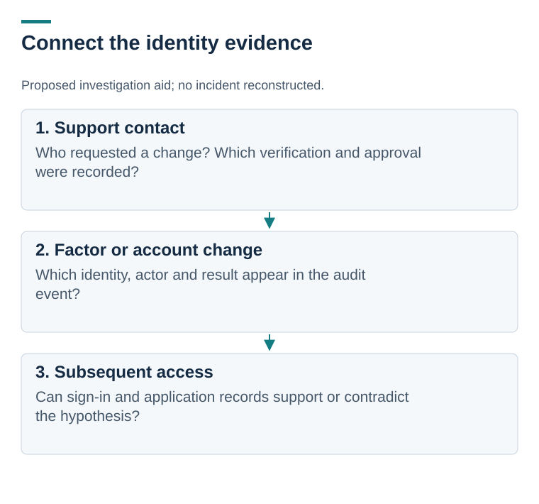

# Identity abuse: turning threat research into investigation questions

[Portfolio home](../../README.md) · [Supported mappings](attack-mapping.md) · [Defensive walkthrough](detection-and-response.md)

**Research and defensive design | MITRE ATT&CK v17.0, public advisories, JSON**

An attacker who persuades a support team to change an account can bypass a technically strong sign-in process. I used public reporting about Scattered Spider to examine that trust boundary.

I organized the research with MITRE ATT&CK, a catalog of adversary behaviors. The retained layer includes **11 selected techniques with direct Scattered Spider relationships in ATT&CK v17.0**. Eight other candidate mappings are listed separately because that exact source relationship was not established.

*An investigation aid based on reported behaviors, not a reconstructed incident or a claim that every attack follows this order. [Open full-size](visuals/scattered-spider-attack-flow.svg).*

## One question worth investigating

A new multifactor authentication (MFA) factor appears after a support interaction. Was it a legitimate recovery, or did an attacker enroll a factor?

I would connect the ticket, verification method, authorizing person, identity audit event, and later sign-ins. A factor change alone is insufficient to decide. The [walkthrough](detection-and-response.md) includes ordinary explanations and evidence gaps.

## What I produced

- [A sourced mapping table](attack-mapping.md) and [machine-readable relationship references](evidence/selected-relationships.json)
- [An ATT&CK Navigator layer](attack-navigator-layer.json), a JSON file for exploring the selected techniques
- [Proposed investigation questions](detection-and-response.md) and [validation work](response-backlog.md)
- [Source notes](sources-and-methodology.md), including version and attribution limits

**Outcome:** a research brief that makes its evidence boundaries visible. No detection rules were deployed, attack emulation performed, or security coverage measured. Navigator application rendering is still unverified.

**What I learned:** a valid technique ID is not enough. The behavior, source, actor attribution, tactic, and version all need to agree.

[Next: cloud log investigation](../04-aws-cloud-security-log-investigation/README.md)

[Additional charts and diagrams](visuals/README.md)
