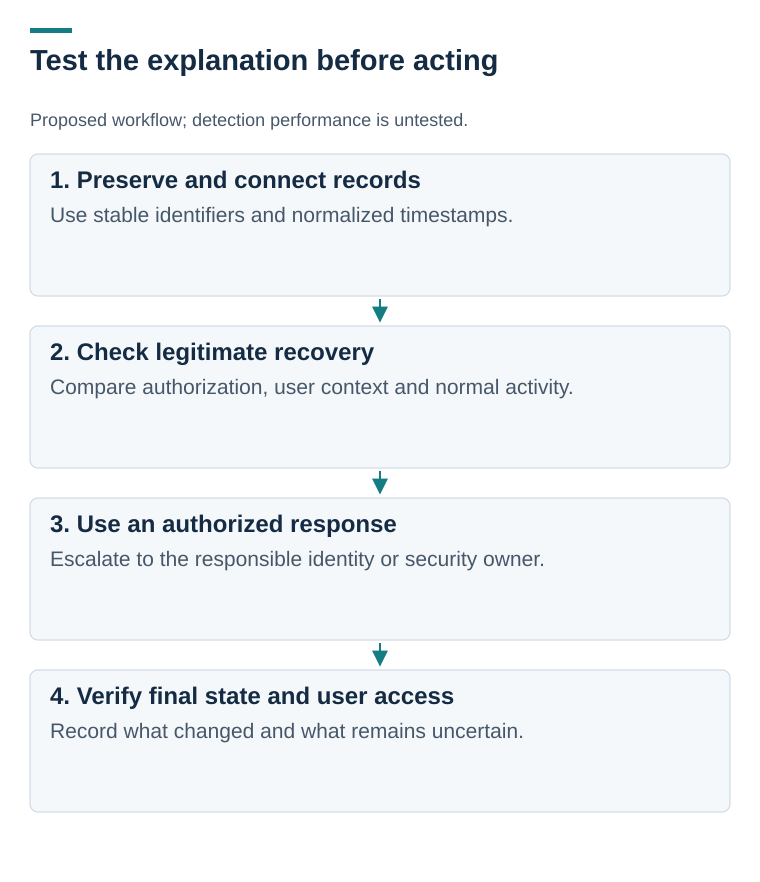

# Walkthrough: investigate a factor change after support contact

[Project overview](README.md) · [Mappings](attack-mapping.md) · [Validation backlog](response-backlog.md)

**Proposed investigation. No identity platform or SIEM rule has been deployed.** A SIEM is a system for collecting and searching security events.

## Begin with a question, not a verdict

ATT&CK v17.0 links G1015 to T1556.006, modification of multifactor authentication. Reported attacker enrollment of factors makes recovery events worth investigating. A new factor is also a normal outcome of legitimate recovery.

| Evidence to connect | What I would examine | Ordinary explanation to consider |
| --- | --- | --- |
| Support ticket | Request, verified identity, authorizer, agent, timestamps | Legitimate replacement of a lost device |
| Identity audit event | Target account, actor, old/new factor metadata, event result | Approved enrollment or administrative maintenance |
| Sign-in records | Result, device, session, source context, time relationship | Travel, a new device, or a shared network |
| Access and application records | Role changes, unusual downloads, affected resources | Approved work with a documented need |

Correlate stable account and event identifiers where available. A matching display name or shared IP address is weak evidence. Normalize timestamps and check collection gaps before asserting an order.

## Make the decision defensible

If the ticket’s identity verification and authorization are missing or inconsistent with the platform event, preserve the evidence and route the case to the identity/security owner. Any session revocation, account restriction, or factor removal would require that team’s authorized response procedure.

If verification, approval, and subsequent access match legitimate activity, record the basis for the disposition. Missing logs should remain an unresolved limitation.

*Proposed workflow. Recovery must be verified after any authorized response; an issued command alone is not proof of restoration.*

## What would make this a tested detection

Define a platform-specific event schema, required logging, correlation window, exclusions, and severity policy. Exercise legitimate recovery, unauthorized change, denied change, repeated requests, and missing-event cases. Record false positives, missed cases, and the analyst’s decision. None of those performance results exists yet.
