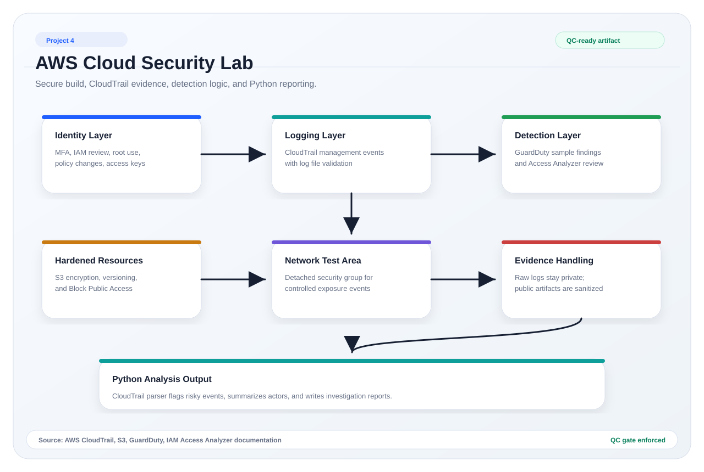
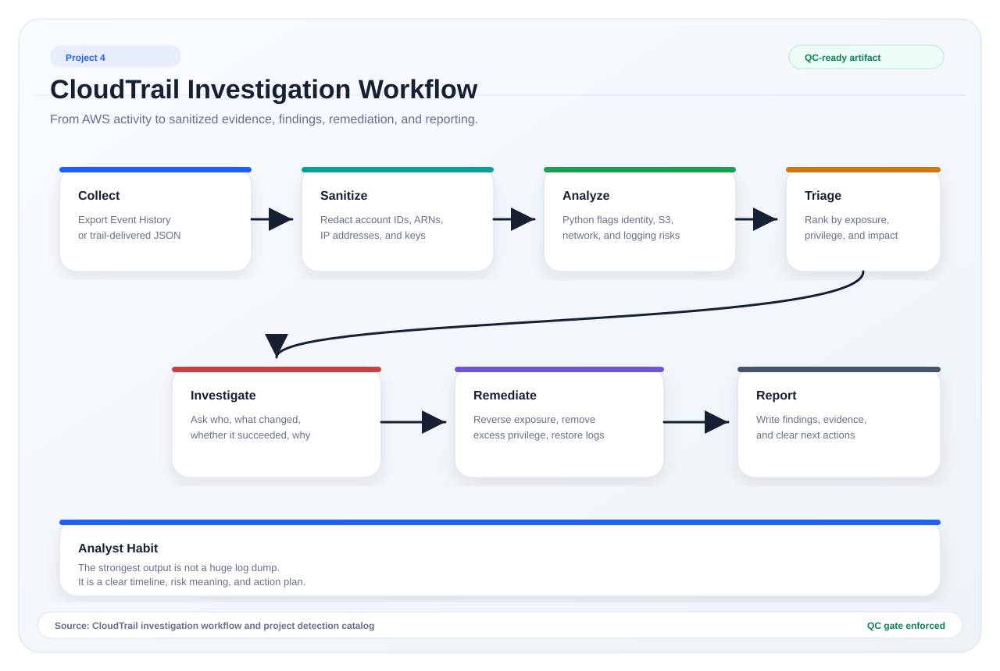
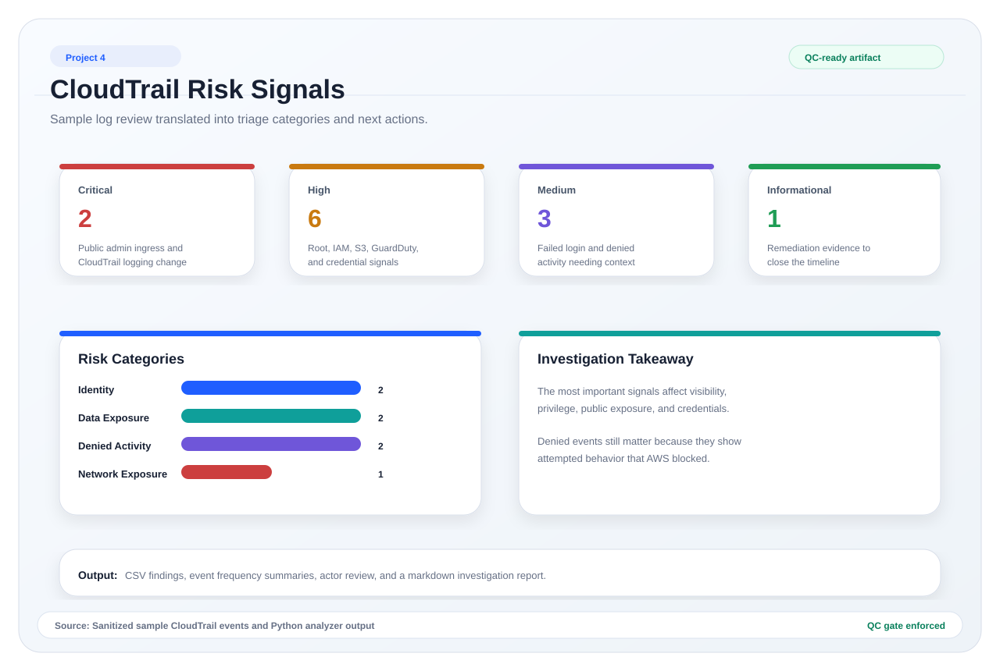

# AWS Cloud Security Monitoring And Log Investigation Lab

## Overview

This project builds a small AWS security lab and uses CloudTrail-style event data to practice cloud log investigation, detection logic, and risk-based remediation.

The project is designed around a practical security analyst question:

> If I inherit a small AWS environment, what logs and controls help me understand who changed what, which actions created risk, and what should be fixed first?

The lab focuses on identity, logging, S3 exposure, security group exposure, GuardDuty triage, and Python-based CloudTrail analysis. It is written as a hands-on project that can be run in a personal AWS account, then documented safely with sanitized evidence.

## Why This Project Matters

Cloud security roles often require a blend of technical investigation and risk communication. A good analyst needs to know how to read logs, identify meaningful events, understand which controls reduce exposure, and explain what happened in plain business language.

This project demonstrates that workflow:

- build a small AWS environment
- enable security monitoring and logging
- apply baseline hardening controls
- generate safe administrative activity
- review CloudTrail and GuardDuty evidence
- automate log analysis with Python
- translate findings into remediation and executive notes

## Lab Scope

The lab uses AWS services that commonly appear in entry-level cloud security, SOC, GRC, and security analyst conversations:

| Area | AWS service or concept | What it demonstrates |
|---|---|---|
| Account activity logging | AWS CloudTrail | Who performed which management action, from where, and when |
| Threat detection | Amazon GuardDuty | Managed findings based on AWS data sources |
| Object storage security | Amazon S3 | Encryption, versioning, and Block Public Access |
| Identity and access | AWS IAM | Root activity, policy changes, access keys, and least privilege |
| Network exposure | Amazon VPC security groups | Detection of public administrative access paths |
| External access review | IAM Access Analyzer | Resource access visibility and public/cross-account review |
| Automation | Python | Repeatable parsing, detection, summaries, and markdown reporting |

## Project Deliverables

- [`architecture.md`](architecture.md): lab architecture and security design
- [`cloudformation/aws-cloud-security-lab.yaml`](cloudformation/aws-cloud-security-lab.yaml): deployable AWS lab template
- [`docs/aws-build-and-hardening-guide.md`](docs/aws-build-and-hardening-guide.md): secure setup and hardening checklist
- [`docs/log-collection-guide.md`](docs/log-collection-guide.md): how to generate and export real CloudTrail evidence safely
- [`docs/cloudtrail-field-guide.md`](docs/cloudtrail-field-guide.md): how to read CloudTrail fields during an investigation
- [`docs/investigation-playbook.md`](docs/investigation-playbook.md): analyst workflow for triaging cloud events
- [`docs/cleanup-guide.md`](docs/cleanup-guide.md): cleanup steps to reduce cost and exposure
- [`docs/resume-and-interview-notes.md`](docs/resume-and-interview-notes.md): project-safe resume bullets and interview talking points
- [`detections/cloudtrail-detection-catalog.md`](detections/cloudtrail-detection-catalog.md): detection logic and analyst notes
- [`detections/cloudtrail-detection-rules.json`](detections/cloudtrail-detection-rules.json): structured detection rules used by the Python analyzer
- [`scripts/analyze_cloudtrail.py`](scripts/analyze_cloudtrail.py): CloudTrail parser and finding generator
- [`scripts/sanitize_cloudtrail.py`](scripts/sanitize_cloudtrail.py): helper for redacting sensitive identifiers before public sharing
- [`data/sample-cloudtrail-events.json`](data/sample-cloudtrail-events.json): sanitized sample events for repeatable local testing
- [`outputs/sample-cloudtrail-investigation-report.md`](outputs/sample-cloudtrail-investigation-report.md): generated sample investigation report
- [`visuals/`](visuals/): architecture and workflow visuals checked by the repository visual quality gate

## Visual Snapshot







## Evidence Handling

Raw cloud logs can contain sensitive information. This project keeps public evidence safe by using a sanitized sample dataset and documenting how real AWS exports should be redacted before publishing.

## Evidence Status

The committed dataset is sanitized sample evidence for reproducible local testing. The CloudFormation template, build guide, log collection guide, sanitizer, analyzer, and reporting workflow are ready for a live AWS lab run. Real CloudTrail exports should be collected privately, sanitized, and reviewed before any public artifact is added.

Recommended public approach:

1. Keep raw CloudTrail exports private.
2. Sanitize account IDs, source IPs, user names, ARNs, access key IDs, and resource names.
3. Commit only sanitized excerpts, generated summaries, screenshots with sensitive fields removed, and analyst writeups.
4. Keep enough evidence to show real log-reading work without exposing the account.

## How To Run The Sample Analysis

From this project folder:

```powershell
python scripts/analyze_cloudtrail.py data/sample-cloudtrail-events.json --output-dir outputs
```

Expected generated files:

- `outputs/cloudtrail-findings.csv`
- `outputs/event-name-frequency.csv`
- `outputs/event-source-frequency.csv`
- `outputs/actor-frequency.csv`
- `outputs/sample-cloudtrail-investigation-report.md`

## How To Use With Real AWS Logs

1. Deploy the CloudFormation template in a personal AWS lab account.
2. Follow the build and hardening guide.
3. Generate safe administrative events.
4. Export CloudTrail Event History as JSON.
5. Store raw exports privately.
6. Run the sanitizer.
7. Run the analyzer against the sanitized log file.
8. Add the generated report and a short investigation summary to the project.

Example:

```powershell
python scripts/sanitize_cloudtrail.py private/raw-cloudtrail-events.json data/sanitized-cloudtrail-events.json
python scripts/analyze_cloudtrail.py data/sanitized-cloudtrail-events.json --output-dir outputs
```

## Key Analyst Skills Represented

- CloudTrail log reading
- IAM and root account activity review
- AccessDenied and error-code triage
- Security group exposure detection
- S3 public exposure review
- GuardDuty finding interpretation
- Python log parsing and report generation
- Cloud hardening documentation
- Risk-based remediation planning
- Public-safe evidence handling

## Source References

- AWS CloudTrail Event History: https://docs.aws.amazon.com/awscloudtrail/latest/userguide/view-cloudtrail-events.html
- AWS CloudTrail Event History console download: https://docs.aws.amazon.com/awscloudtrail/latest/userguide/view-cloudtrail-events-console.html
- AWS CloudTrail cost management: https://docs.aws.amazon.com/awscloudtrail/latest/userguide/cloudtrail-trail-manage-costs.html
- Amazon GuardDuty data sources: https://docs.aws.amazon.com/guardduty/latest/ug/guardduty_data-sources.html
- Amazon GuardDuty pricing and free trial: https://docs.aws.amazon.com/guardduty/latest/ug/guardduty-pricing.html
- Amazon S3 Block Public Access: https://docs.aws.amazon.com/AmazonS3/latest/userguide/access-control-block-public-access.html
- AWS CloudFormation S3 PublicAccessBlockConfiguration: https://docs.aws.amazon.com/AWSCloudFormation/latest/TemplateReference/aws-properties-s3-bucket-publicaccessblockconfiguration.html
- AWS CloudFormation IAM Access Analyzer: https://docs.aws.amazon.com/AWSCloudFormation/latest/TemplateReference/aws-resource-accessanalyzer-analyzer.html

## Boundary Statement

This is a personal cloud security lab and public portfolio project. It does not represent a production AWS environment, a penetration test, a formal compliance audit, or a security assessment of any real organization.
