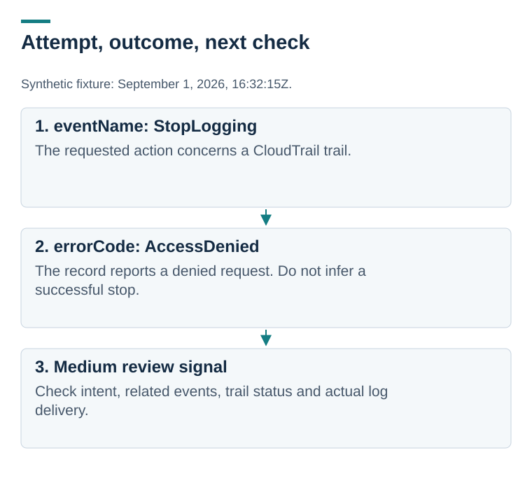

# Reading cloud activity without overstating the evidence

[Portfolio home](../../README.md) · [Worked investigation](walkthrough.md) · [Code](scripts/analyze_cloudtrail.py)

**Offline simulation | Python, JSON, AWS CloudTrail-style management events**

Cloud activity logs record actions and outcomes. An event name alone can give the wrong answer: a request to stop logging might have been denied.

I built an offline analyzer and investigation narrative around **12 synthetic events**. The analyzer checks outcomes, service names, identity context, and relevant request fields before producing review signals.

*The event establishes a denied request. It does not establish that logging stopped, that every trail is healthy, or that an account was compromised. [Open full-size](visuals/cloudtrail-investigation-workflow.svg).*

## What the analysis produces

The supplied fixture produces **10 review signals: 5 High, 3 Medium, and 2 Informational**. These are review-urgency labels, not confirmed incidents.

The [walkthrough](walkthrough.md) follows the denied logging request, a world-accessible security-group rule, and a later removal request. It explains what additional evidence would be needed to prove reachability or restoration.

## Inspect the work

- [Synthetic input](data/sample-cloudtrail-events.json) and [input limitations](data/README.md)
- [Generated investigation report](outputs/sample-cloudtrail-investigation-report.md) and [findings CSV](outputs/cloudtrail-findings.csv)
- [Python analyzer](scripts/analyze_cloudtrail.py), [signal behavior](detections/cloudtrail-detection-catalog.md), and [regression tests](../../tests/test_analysis.py)
- [Reproduction commands](../../SETUP_GUIDE.md)
- [Separate proposed AWS lab](architecture.md), with a CloudFormation template that has not been deployed

**Outcome:** a reproducible local investigation exercise that separates attempted actions, accepted requests, and unknown final state. It does not establish live AWS experience, data exfiltration, or completed remediation.

**What I learned:** a useful finding explains the evidence, uncertainty, and next check. “No API error” and “remediated” are different claims.

[Next: academic security design](../05-serenity-bank-capstone/README.md)

[Additional charts and diagrams](visuals/README.md)
