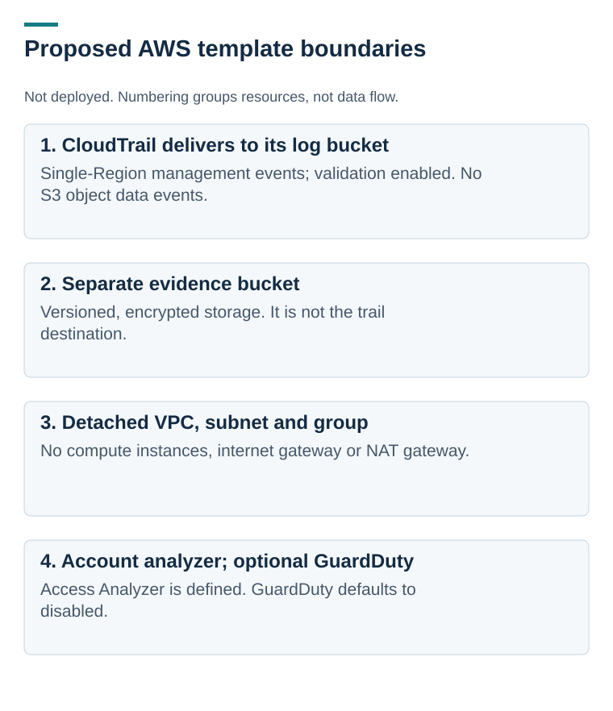

# What runs locally, and what is only proposed

[Project overview](README.md) · [Template](cloudformation/aws-cloud-security-lab.yaml)

## Implemented offline path

Synthetic JSON → input validation and deduplication → Python signal logic → CSV findings and Markdown report.

No AWS credentials, network calls, SDK, or deployment are required to reproduce that path.

## Proposed AWS collection lab

*The diagram describes the template. It is not a deployed architecture or evidence that logs were collected.*

The template defines two encrypted, versioned S3 buckets with all four bucket-level public-access-block settings; a single-Region trail with management-event logging and log-file validation; an account-level IAM Access Analyzer; a VPC, subnet, and detached security group; and optional GuardDuty, disabled by default.

The trail’s bucket policy restricts the CloudTrail service to the named trail with aws:SourceArn conditions. It does not grant an arbitrary trail permission to write.

## Boundaries worth inspecting

- No instances, internet gateway, or NAT gateway are defined.
- No S3 object data events are selected. Management logs do not prove object reads or exfiltration.
- Encryption is SSE-S3; this template does not define a customer-managed KMS key.
- Log-file validation produces integrity evidence; it does not itself prove log delivery or complete monitoring.
- The synthetic fixture spans Regions and is not an export from this single-Region design.
- Template checks are static. AWS validation, deployment, cost, service availability, and cleanup behavior remain untested.

See the [build and validation plan](docs/aws-build-and-hardening-guide.md) before considering a deployment.

The bucket-policy restriction follows the [AWS CloudTrail bucket policy guidance](https://docs.aws.amazon.com/awscloudtrail/latest/userguide/create-s3-bucket-policy-for-cloudtrail.html). Provider guidance is a design reference, not evidence of deployment.
