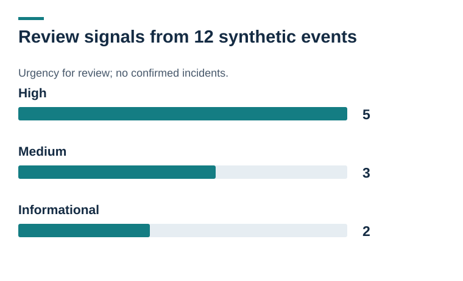

# Visual evidence and diagrams

[Project overview](../README.md)

## Proposed AWS template boundaries

Not deployed. Numbering groups resources, not data flow. CloudTrail delivers to its log bucket: Single-Region management events; validation enabled. No S3 object data events. Separate evidence bucket: Versioned, encrypted storage. It is not the trail destination. Detached VPC, subnet and group: No compute instances, internet gateway or NAT gateway. Account analyzer; optional GuardDuty: Access Analyzer is defined. GuardDuty defaults to disabled. [Open full-size](aws-lab-architecture.svg).

## Attempt, outcome, next check

Synthetic fixture: September 1, 2026, 16:32:15Z. eventName: StopLogging: The requested action concerns a CloudTrail trail. errorCode: AccessDenied: The record reports a denied request. Do not infer a successful stop. Medium review signal: Check intent, related events, trail status and actual log delivery. [Open full-size](cloudtrail-investigation-workflow.svg).

## Review signals from 12 synthetic events

Urgency for review; no confirmed incidents. High: 5; Medium: 3; Informational: 2 [Open full-size](cloudtrail-risk-signals.svg).
