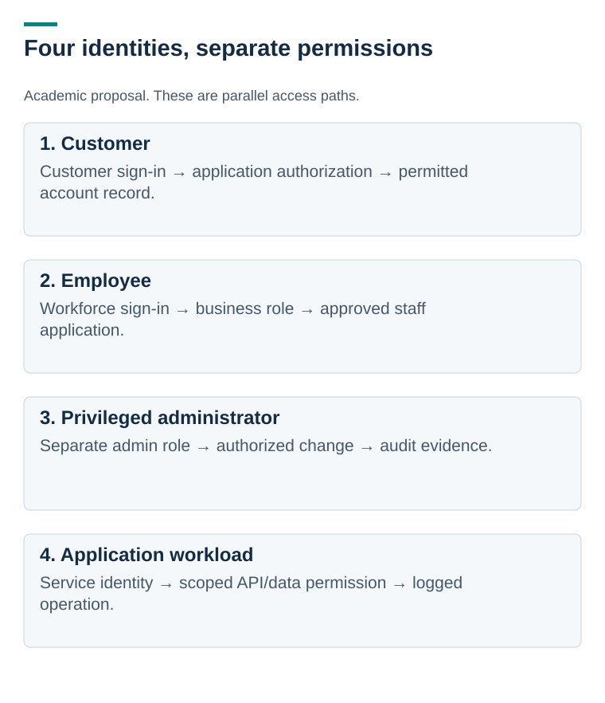

# Serenity Bank: an academic security design

[Portfolio home](../../README.md) · [Design walkthrough](design-walkthrough.md) · [Decisions and validation](decisions-and-validation.md)

**Individual academic capstone | Fictional bank | Architecture and control reasoning**

The capstone brings together security recommendations for a fictional bank using cloud services. The problem is broader than choosing tools: customers must reach their own data, staff must perform authorized work, and administrators must operate systems without collapsing those trust boundaries.

This overview is based on my academic submission, **“7.1 Putting It All Together.”** It refines the presentation of the design and makes the validation gaps explicit. The architecture below is a proposed clarification, not an implementation result or a reproduction of a deployed system.

*Customer authentication does not grant cloud administration. Each identity path needs its own authorization and audit evidence. [Open full-size](visuals/identity-boundaries.svg).*

## The decision to inspect

A customer signs in and requests an account record. Sign-in establishes an identity. The application must separately check whether that identity is authorized for that particular record. Encryption at rest and a web application firewall do not replace that check.

The [walkthrough](design-walkthrough.md) follows that request, then contrasts it with employee, administrator, and workload access. It also explains what evidence would be needed to demonstrate recovery.

## What exists

- An academic security proposal, summarized here for a portfolio reader
- A clarified identity-boundary diagram
- A [decision and validation table](decisions-and-validation.md), covering access, keys, logging, and recovery

No bank, AWS/Azure environment, incident-response operation, or disaster-recovery test was implemented by this portfolio project. Named services are design options.

**My contribution:** I completed this capstone as an individual project and authored the submitted report. This portfolio summarizes my analysis and clarifies the proposed design. The full academic document is not included in this repository; the walkthrough and decision table provide the public review material.

**What I learned:** a product name does not describe a control. A useful design names the protected action, who can perform it, what could fail, and how the result would be tested.

[Next: service desk workflow design](../06-service-desk-workflows/README.md)
