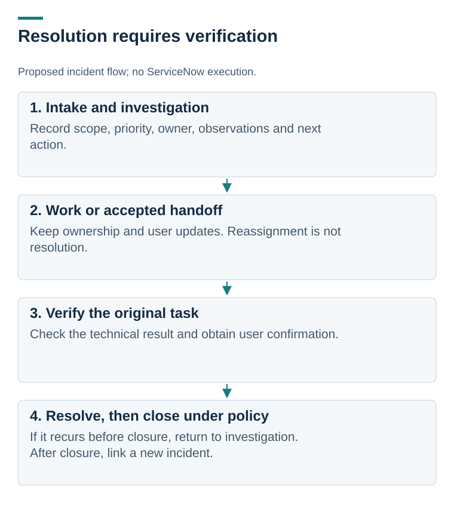

# Service desk workflows: from a user report to verified restoration

[Portfolio home](../../README.md) · [Scenario catalog](docs/scenario-catalog.md) · [Evidence status](docs/evidence-status.md)

**Design draft | Ten scripted scenarios | ServiceNow execution pending**

A useful ticket tells the next technician what the user needs, what has been checked, what remains uncertain, and who owns the next action.

I designed ten support scenarios for the fictional Northstar Learning Services. They cover incident triage, troubleshooting, access approvals, user updates, escalation, and verification. The scenarios were informed by a [small sample of four job descriptions](research/linkedin-role-analysis.md); that sample does not establish market-wide frequency.

## Start with one case

**[VPN connects, but the application does not open](tickets/03-vpn-dns.md).** Follow the distinction between a connected tunnel, name resolution, network connectivity, and actual application access. The case stays open during handoff until restoration is verified.

*Proposed workflow, not a ServiceNow screenshot. Reassignment is not resolution, and a successful test must cover the user’s original task. [Open full-size](diagrams/incident-lifecycle.svg).*

## Choose a different decision

- [Printing returns after an initial restoration](tickets/04-printer-reopen.md): verify both a test page and the original application, then handle recurrence.
- [Read-only file-share access](tickets/06-file-share-access.md): distinguish approval from fulfillment and check both allowed and prohibited actions.
- [Reported phishing](tickets/08-phishing-report.md): preserve useful context and hand off without claiming a completed security investigation.
- [MFA recovery](tickets/10-mfa-recovery.md): stop when an approved identity-verification procedure is missing.

## What is built, and what comes next

**Built:** ten written playbooks, sample work notes and user messages, a fictional service policy, knowledge articles, explanatory diagrams, and a platform evidence plan.

**Pending:** a ServiceNow learning instance, configuration and access tests, actual incident/request records, endpoint actions, screenshots, and SLA measurements. An SLA is a service-level agreement; the draft timings are fictional policy choices.

The ticket notes are scripted examples. They cannot be presented as actions already performed. Before unlocking an account or recovering a factor, the lab also needs an approved verification method, prerequisites, failure path, and permitted agent role.

[All ten scenarios](docs/scenario-catalog.md) · [Proposed policy](docs/lab-service-policy.md) · [ServiceNow setup plan](docs/servicenow-setup-and-evidence-plan.md) · [What to capture](evidence/README.md)

**What I learned from designing the cases:** a technically plausible fix is incomplete without authorization, user communication, and evidence that the original service works.

[Return to the portfolio](../../README.md)

[All workflow illustrations](diagrams/README.md)
