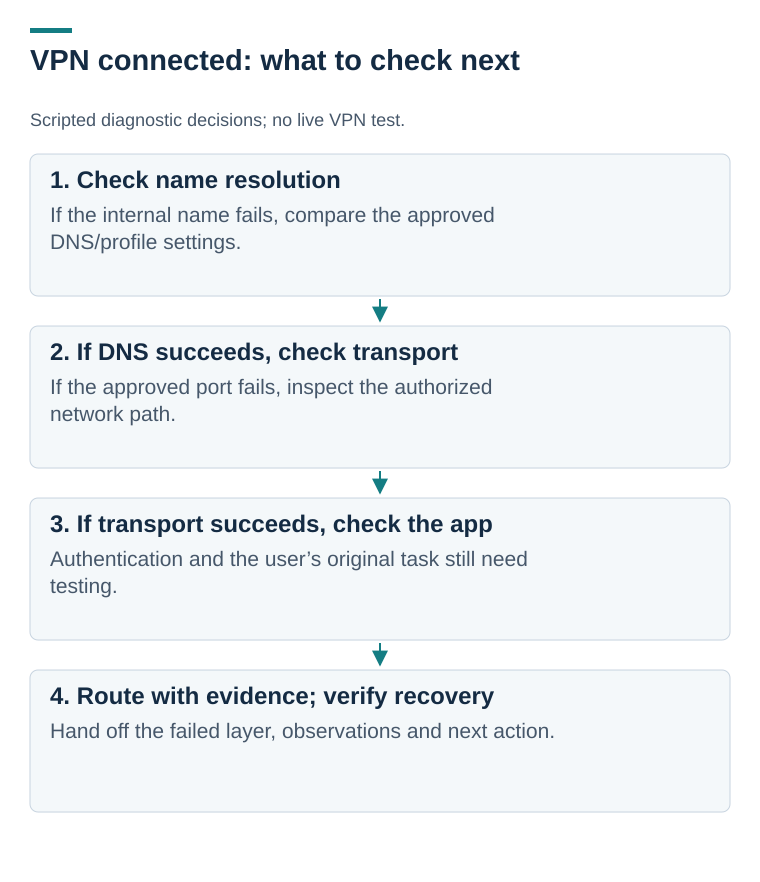

# KB-002 : VPN connects but an internal application fails

**Status:** untested draft. **Audience:** L1 / Network lab agents. **Owner:** learner role-play. **Version:** 0.1. **Last tested:** not tested. **Scope:** owned, isolated lab services.

## Applies when

The approved VPN client reports connected but an internal application is unavailable. Tunnel establishment is one observation, not proof that name resolution, routing, transport, authentication or application behavior is correct.

## Safe diagnostic order

1. Record the exact application/error, device, VPN profile/version, time/timezone, business effect and workaround.
2. Confirm scope: another user, another internal application, and another network when available. A new second report can change the incident's impact.
3. Review the approved tunnel and local network configuration. Do not disable endpoint security or change a global route to “test.”
4. Resolve the configured owned app hostname. Failure here routes into DNS/profile investigation; transport testing by hostname may otherwise conflate two layers.
5. Once resolution works, test the approved application port. TCP success only proves connection establishment at that layer.
6. Test application sign-in and a harmless user task. If this fails after transport works, route to the application/identity owner.

## Example diagnostic commands : not executed

Replace the name below with a configured owned lab service. The reserved example-domain name is a placeholder and is not expected to resolve. Do not paste fabricated output into evidence.

~~~powershell
Resolve-DnsName -Name "teamapp.lab.example"
Test-NetConnection -ComputerName "teamapp.lab.example" -Port 443 -InformationLevel Detailed
~~~

Microsoft documents [Resolve-DnsName](https://learn.microsoft.com/en-us/powershell/module/dnsclient/resolve-dnsname) as a name-resolution query and [Test-NetConnection](https://learn.microsoft.com/en-us/powershell/module/nettcpip/test-netconnection?view=windowsserver2025-ps) as a network diagnostic command. Preserve the actual command, target, result and context if run. Sanitize topology details before publication.

## Stop / escalation conditions

Unknown or unapproved profile; security concern; multiple-user pattern; configuration change outside delegated authority; no authorized target; or a tested layer indicating the responsible team's intervention is needed.

Do not replace internal DNS with a public resolver, bypass certificate validation, or call a failed ping definitive proof of an outage. Record the evidence and request the specific team's action.

## Handoff and verification

Send scope, timing, exact error, known-good comparison, DNS result, transport result, profile/client details, action history and pending question. Record receiver acceptance or pending transfer and the next user update.

After correction, repeat name resolution, approved-port connectivity, application sign-in and the harmless task. User confirmation remains necessary. A corrected DNS result alone does not substantiate full restoration.

## Validation required before publication

- [ ] DNS failure routes to the DNS/profile branch.
- [ ] TCP failure after successful DNS remains distinguishable.
- [ ] Successful TCP with failed app sign-in routes to the app/identity branch.
- [ ] A second user's report triggers scope reassessment.
- [ ] No live system was changed outside the authorized lab.

Related exercise: [LAB-INC-003](../tickets/03-vpn-dns.md).
